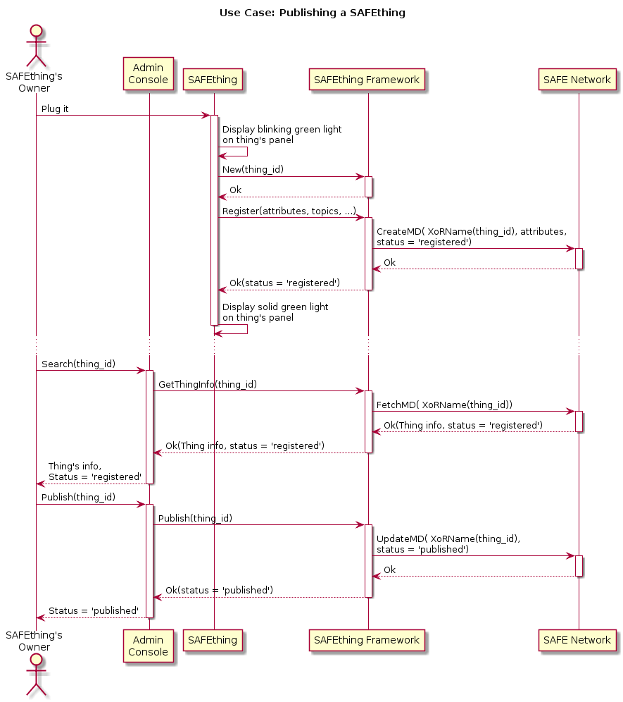
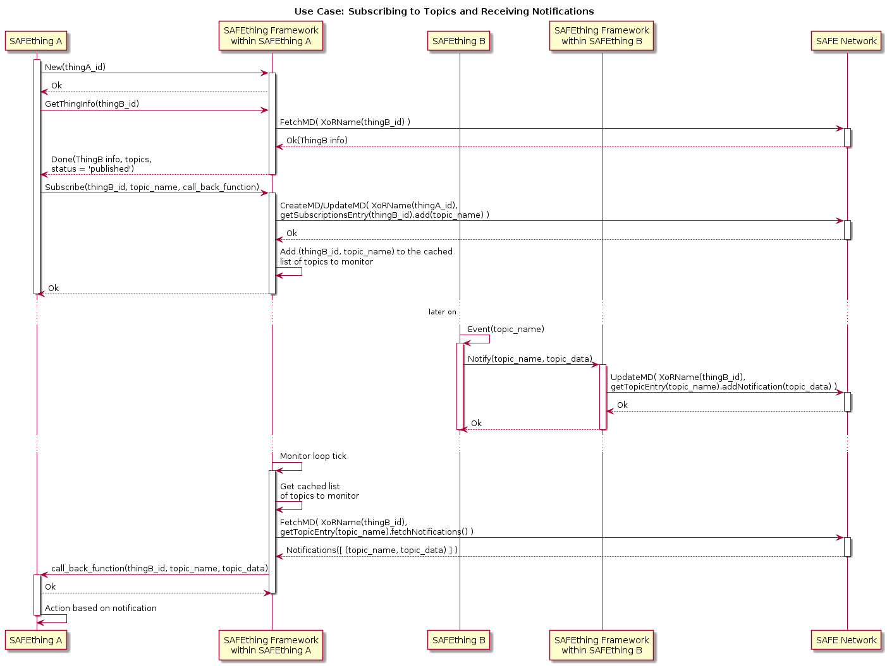

# SAFEthing Framework
**S**ecure **A**ccess **F**or **E**very**thing**

### Project Goals
- Provide IoT software developers with an easy and straight forward way to integrate their IoT devices to the SAFE Network without worrying about network, security and/or authentication & authorisation protocols.
- Create a project which can be used as a knowledge base for developers trying to learn and implement software for the SAFE Network.
- Allow the SAFE Network community to participate in a project which creates added value for the SAFE Network, and which leads to help promoting it and to achieve mass adoption.
- Ultimately, **have the next-gen IoT framework and communication protocol to be designed and developed by the SAFE Network community itself!**

### Run example SAFEthing application

This project is in its very early stage, at the moment there is a tiny example application (`/core/examples/printer.rs`) which showcases how the SAFEthing API is intended to be used. You can run this example app with the following commands (please make sure you have rustc v1.33.0 or later):
```
$ git clone https://github.com/bochaco/safe_thing.git
$ cd ./safe_thing/core
$ cargo run --example printer --features "fake-auth use-mock-routing"
```

### The Library and API
The SAFEthing library is composed of several parts but its core is just a Rust crate with a simple and well defined Rust API.

Internally it contains all the mechanisms to communicate with the SAFE Network through the [safe_client_libs](https://github.com/maidsafe/safe_client_libs), abstracting the client application from all of it without the need for the application developer to even understand how the SAFE Network works.

In an analogous way as to how the SAFE Network itself provides different programming languages bindings, there will be a SAFEthing Rust FFI interface which can be used to interact with the API from any programming language, like C/C++, but also a set of different language bindings so people can develop their SAFEthings software even with JavaScript, Python, Lua, Go, etc.

A WebService API will also be created on top of the Rust API to allow the communication with the SAFEthings network through a REST interface. This is mainly intended to support smart home devices, and tools potentially needed to provision them.


### SAFEthings
When a SAFEthing registers to the network it provides a set of information which describes its behaviour, functionality and/or service it exposes.

#### Attributes
Attributes are exposed to provide information about the device/thing to other things that connect to the network. They can also be used by humans to identify the device and/or its functionalities when connecting to it through a console/portal.

An attribute can be either static or dynamic. Some examples of static attributes are the firmware version, device name and model, and their values do not depend or change according to the thing's functioning or state. Note these attributes could still be changed/modified by the user, but in the sense that their values are not tied to the device's state.

On the other hand, some attributes could contain dynamic values which are updated by the SAFEthing, e.g. a temperature sensor could update a dynamic attribute with the current reading, or a SAFEthing with a more complex functionality could expose an attribute which describes its current state.

#### Topics
A SAFEthing can expose a set of topics that other SAFEthings can subscribe to in order to receive notifications upon events.

Different events result in different type of notifications, a topic can describe a certain type of events, depending on how the SAFEthing is designed to expose them.

As an example, the temperature sensor can expose a "temperature change" topic that another SAFEthing can subscribe to and receive notifications upon a temperature change event.

When subscribing to a topic, a set of filters can optionally be provided in order to reduce the notifications to be received to just those which the subscriber is really interested in. E.g. a SAFEthing might be interested in being notified only if the current temperature goes over a threshold.

TODO: describe subscriptions and notifications filters & parameters

#### Actions
Another way to interact with a SAFEthing is by requesting an action. The set of actions are usually static but there could be cases that a SAFEthing wants to expose some actions only in certain moments or periods of time.

Each action is exposed with a name, a set of input parameters it expects and/or supports, and the definition of its output.

The execution of an action is asynchronous. When an action is requested to a SAFEthing, it is added to its actions requests queue. The order and/or priority of execution of each of the actions is application specific, although the framework will provide some utilities to retrieve them in the order it was predefined for the SAFEthing.

#### Access Type
SAFEthing's Attributes, Topics, and Actions, are associated to an Access Type. The Access Type defines the set of SAFEthings that are allowed to access the exposed functionality and information.

As an example, the data you send to a SAFEthing printer should be encrypted and available to access by the sender and the printer devices only. Or if you have a set of devices at home that interact among them, you will want that only your devices can see each other's information and functionalities but no one else.


### The Communication Protocol
TODO

#### Use cases

##### Register and Publish


##### Subscriptions and Notifications


##### Wallet
TODO

### Example of SAFEthing Rust client

``` rust
extern crate safe_thing;

use safe_thing::{SAFEthing, ThingAttr, Topic, ActionDef, AccessType};

fn subscriptions_notif(thing_id: &str, topic: &str, data: &str) {
    println!(
        "New event: Notification received from thing_id: {}, topic: {}, data: {}",
        thing_id, topic, data
    )
}

pub fn main() {
    let id = "printer-serial-number-01010101";

    let auth_uri = "safe-bmv0lm1hawrzywzllmv4yw1wbgvzlm1krxhhbxbszq:AQAAAOIDI_gAAAAAAAAAACAAAAAAAAAAGWzDHH2GG-TUtS_qLvytHNXrAPWGtI6QLDuoP28EE_0gAAAAAAAAALPyoRvbtvPKs9bWYhkdhfkltybFTBJerAWEARetysrtvsjSRTHVRTA_a6ysxSGIUWz9pOLlq9hRMM-EJQctDpVkhRTXPar-W0AAAAAAAAAA-O8HsVV5ZZbiAwWTTFXQeNX7pSYtLmZXRHnrdVyXZvv_a6ysxSGIUWz9pOLlq9hRMM-EJQctDpVkhRTXPar-WyAAAAAAAAAAUnTeCf39C-KDfioarbgDedqYhu_ZEpCHK_CatkiYNFUgAAAAAAAAAOTkFE7GibxaH0egTV1NtczggZkyAsCVRY6AcbceiSNfAAAAAAAAAAAAAAAAAAAAAAAAAAAAMCralz2EJh0ML2wMZLBhh0hELI1dIQUlVtaWHqIClqmYOgAAAAAAABgAAAAAAAAA2lo16ByCIq4SnojMIRPV_RSvQIOelGUD";

    let attributes = [
        ThingAttr::new("name", "SAFEthing Printer"),
        ThingAttr::new("model", "ArduinoDigital PRT1"),
        ThingAttr::new("firmware", "v0.1.0"),
        ThingAttr::new("status", "on"),
        ThingAttr::new("ink-level", "%"),
    ];

    let topics = [
        Topic::new("printRequested", AccessType::All),
        Topic::new("printPaid", AccessType::All),
        Topic::new("printSuccess", AccessType::All),
        Topic::new("printFail", AccessType::All),
        Topic::new("outOfInk", AccessType::All),
    ];

    let actions = [
        ActionDef::new("turnOn", AccessType::Owner, &[]),
        ActionDef::new("turnOff", AccessType::Owner, &["timer"]),
        ActionDef::new("print", AccessType::All, &["data", "deliverTo"]),
        ActionDef::new("orderInk", AccessType::Owner, &[]),
    ];

    let mut safe_thing =
        SAFEthing::new(&id, auth_uri, &subscriptions_notif, &action_request_notif).unwrap();

    match safe_thing.register(&attributes, &topics, &actions) {
        Ok(_) => println!("Printer registered on the network"),
        Err(e) => println!("Failed to register SAFEthing: {}", e)
    }

    match safe_thing.status() {
        Ok(status) => println!("Current status: {}", status),
        Err(e) => println!("Failed getting status: {}", e)
    }

    ...
}
```

### Project Development Roadmap

- [ ] Document API
- [ ] Creation of test suite for API
- [ ] Creation of a showcasing app using the test SAFE Network
- [ ] Cross-compilation tools/doc for MIPS
- [ ] Cross-compilation tools/doc for ARM
- [ ] Implementation of FFI interface
- [ ] Implementation of Javascript binding
- [ ] Documentation of the communication protocol
- [ ] Implementation of WebService API


## License

General Public License (GPL), version 3 ([LICENSE](LICENSE))

Copyright (c) 2017-2019 Gabriel Viganotti <@bochaco>.

This file is part of the SAFEthing Framework.

The SAFEthing Framework is free software: you can redistribute it and/or modify
it under the terms of the GNU General Public License as published by
the Free Software Foundation, either version 3 of the License, or
(at your option) any later version.

The SAFEthing Framework is distributed in the hope that it will be useful,
but WITHOUT ANY WARRANTY; without even the implied warranty of
MERCHANTABILITY or FITNESS FOR A PARTICULAR PURPOSE.  See the
GNU General Public License for more details.
